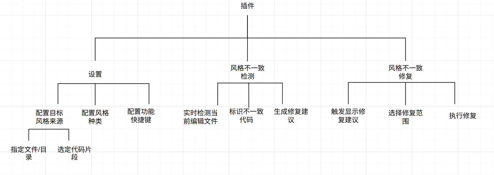
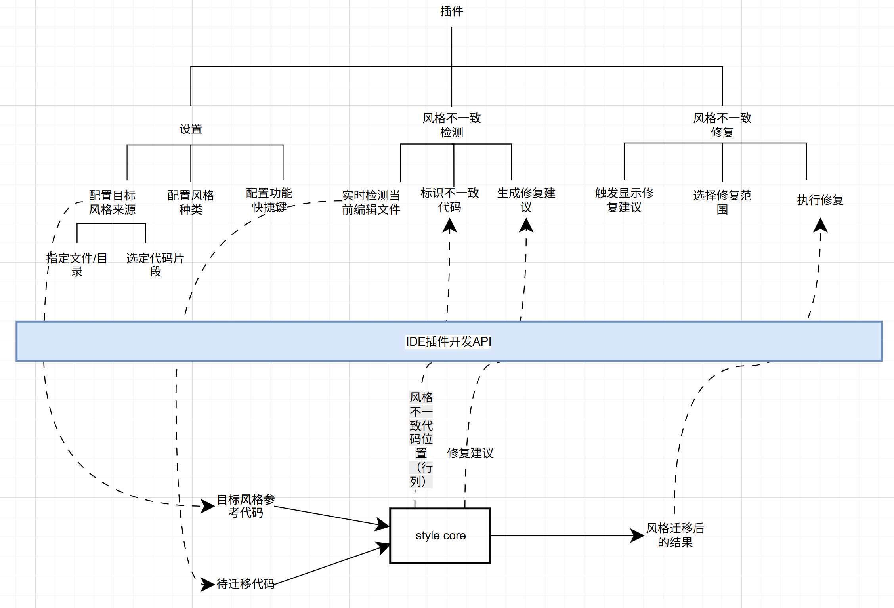
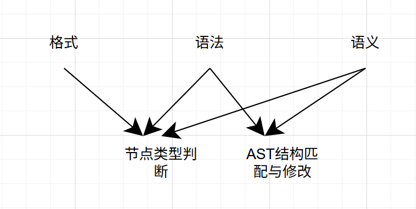
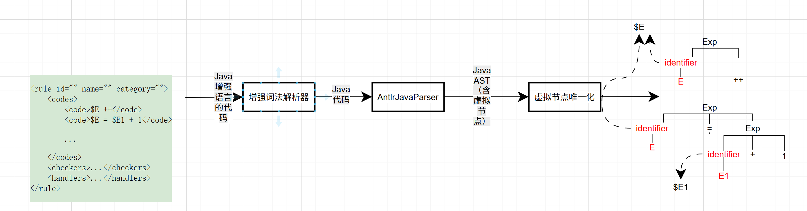
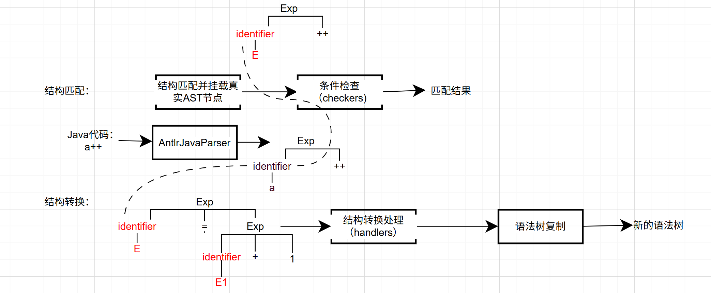

## 插件概述

### 目标
- 风格不一致检测：插件应能够实时检测代码中与现有代码库不一致的部分，并在编辑过程中提供即时反馈。  
- 风格修复建议：插件应能够针对检测到的风格问题提供详细修复建议。  
- 自动风格修复：插件应支持一键自动修复检测到的风格问题。

### 系统范围
- 插件运行于2023.1及以上版本的 IntelliJ IDEA；
- 支持Java，C/C++，C#，Python等主流编程语言。

---

## 插件功能需求

---

## 插件实现

---

## 语言扩展-分析
+ 20种子风格：格式，语法，语义三个层面。**语法和特定语言紧耦合**。
+ 风格迁移过程（风格提取和应用）在程序的TS和AST上执行，包含三个操作：
    + TS/AST遍历（语言无关）
    + **Token/AST节点类型判断**（语言相关）
    + **AST结构的匹配和修改**（语言相关）

---

## 语言扩展-解决方案
+ Token/AST节点类型判断：定义统一的接口MyParser，封装ANTLR生成的不同语言语法树解析器，提供标准化的节点类型判断方法。

+ AST结构的匹配和修改
    + 增强特定编程语言的词法，使用增强的语言定义写法模板
    + 实现增强词法解析器，将增强语言编写代码转换为符合特定编程语言语法的代码，并建立增强词法单元和特定语言AST子树的映射关系
    + 在特定语言的语法树结构上执行匹配和转换

---

+ AST结构的匹配和修改
1. 写法模板加载

---
2. 子树匹配和转换
